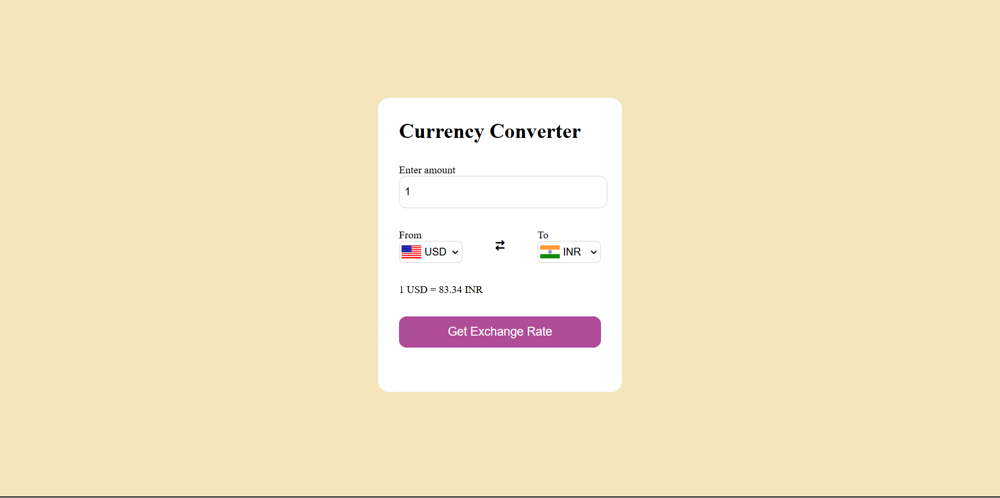

# 💱 Currency Converter Web App

A simple and responsive currency converter built using HTML, CSS, and JavaScript. It allows users to convert between different currencies using real-time exchange rates fetched from an API.

## 🌐 Features

- Convert between major currencies (USD, INR, etc.)
- Clean and responsive design
- Flag icons for selected currencies
- Real-time exchange rate display
- Swap button for switching "From" and "To" currencies

## 📸 Screenshot



## 🛠️ Technologies Used

- HTML
- CSS
- JavaScript
- Exchange Rate API (like exchangerate-api or similar)

## 🚀 How to Run Locally

1. Clone the repository:
   ```bash
   git clone https://github.com/your-username/currency-converter-web.git
   cd currency-converter-web
